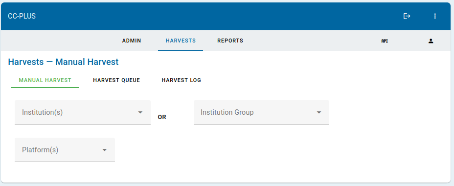
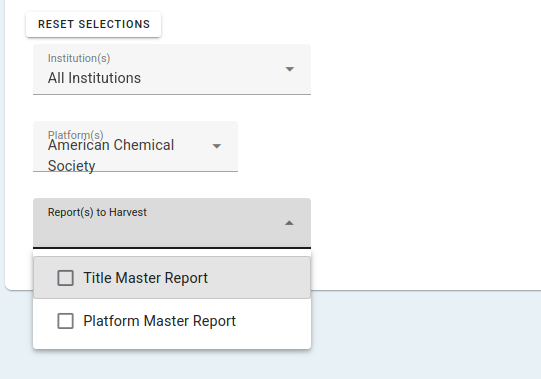
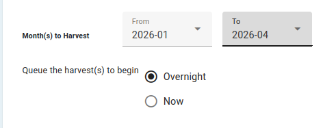
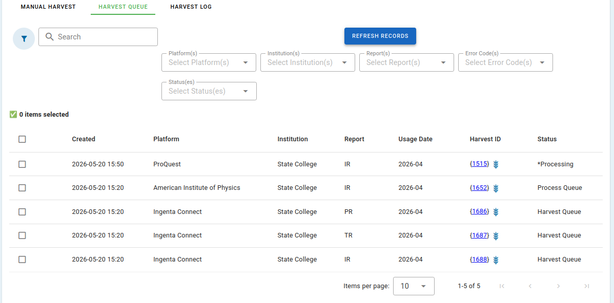
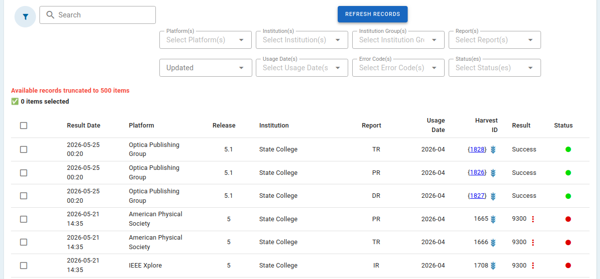

# Harvesting Reports

## Table of Contents
* [Starting a Harvest Manually](#starting-a-harvest-manually)
* [Monitoring Active Harvests](#monitoring-active-harvests)
* [Monitoring Harvest History](#monitoring-harvest-history)

## Starting a Harvest Manually
When a connection is made between an institution and a provider, CC-PLUS will automatically harvest the specified reports on a monthly basis. However, there may be a need to manually harvest or re-harvest data during the initial set-up, or if data from the provider platform has been restated or fixed.

1. Choose Reports -> Manual Harvest from the Main Navigation 

2. Select the institution(s) or group(s) you want to harvest data for
3. Select the platform(s) you would like to harvest from
    * _Note: the options available in this drop-down and the next will reflect all the providers and report types it is possible to harvest. If you select more than one institution or a group, be aware that the provider or report you choose may only be harvestable for some but not all of the institutions, depending on how you have setup the connections._
4. Select the type of report you want to harvest
    * _Note: you may only harvest master reports. This ensures that the database is complete and able to create customized reports later. You will be able to select specific “views” when you retrieve reports._
    
    * Choose the timeframe you want to harvest 
    * Choose whether you would like the harvest to begin immediately, or be queued to run overnight. Choosing immediate harvest, will place these harvests into the queue immediately, but behind any other harvests that are currently queued or being processed.

    
5. Hit the “Submit” button to begin the harvest. You should get a message that the harvests have been added to the queue.

## Monitoring Active Harvests

The Harvest Queue holds records of active and queued harvests. The panel loads and refreshes records on-demand. Harvests are re-attempted when erros are returned to account for typical issues and delays with providers who publish data. The number of retries is controlled by the Server Admin under the Server->Settings panel.

The line for each harvest lists: 
1. the creation date of the harvest
2. the platform
4. the institution
5. the master report type
6. the month that the harvested data reflects
7. the harvest ID with a link to manually re-try
8. the status

The harvest queue can be filtered using the drop-downs at the top of the list. Clicking checkboxes beside each harvest enables the "Bulk Actions" drop-down to affect them. Using this drop-down, you can pause, stop, or restart one or more harvests.

## Monitoring Harvest History

The Harvest Log holds records of completed/past harvests. The panel loads and refreshes records on-demand since the number of records can become unwieldly over time. Harvests are re-attempted when erros are returned to account for typical issues and delays with providers who publish data. The number of retries is controlled by the Server Admin under the Server->Settings panel.

The line for each harvest lists: 
1. the date of the latest attempt
2. the platform
3. the COUNTER release (5/5.1)
4. the institution
5. the master report type
6. the month that the harvested data reflects
7. the harvest ID with a link to manually re-try
8. the result or status/error code (linked to more detail)
9. a colored icon indicator for the status

The harvest log can be filtered using the drop-downs at the top of the list. Clicking checkboxes beside each harvest enables the "Bulk Actions" drop-down to affect them. Using this drop-down, you can restart or delete one or more harvests.

On each harvest line in the log, a failure will also include a brief description of what the last error message was. More information about harvests, including error messages can be found by clicking the 3-dots icon. This will open a new page with the specifics of that harvest. Clicking the Barley icon will re-run the harvest and display the resulting data as JSON in a new window to assist with troubleshooting.

A full list of errors and suggested actions is available [here](resources/COUNTER_error_codes.xlsx). 

