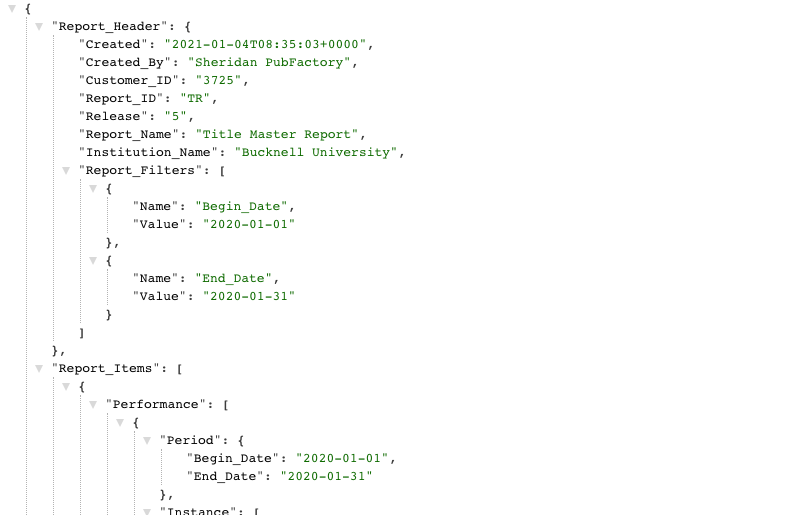
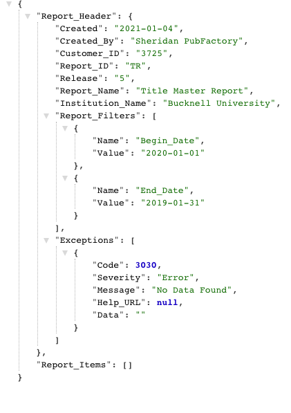
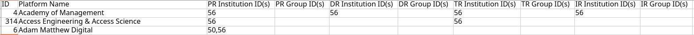
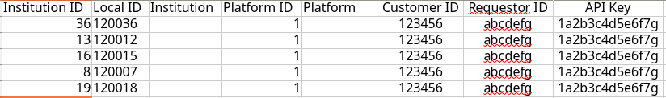
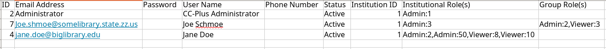

# Initial Tasks For CC-Plus Setup

## Table of Contents
* [Step One: Gather credentials](#step-one)
* [Step Two: Test credentials](#step-two)
* [Step Three: Setup Institutions](#step-three)
* [Step Four: Institution Groups and Types](#step-four)
* [Step Five: Define Provider Connections](#step-five)
* [Step Six: Import COUNTER Credentials](#step-six)
* [Step Seven: User Accounts and Roles](#step-seven)

## Step One: Gather credentials
1. Begin with a list of the provider platforms and which master reports you want to harvest from each. During the application installation, the global providers should have been acquired and setup from the COUNTER registry. They can also be loaded, or refreshed at any time, from the Server->Platforms panel (*Role: ServerAdmin*) using the Registry Refesh option(s) there.
2. Next, for the institutions you plan to work with, you will need some combination of the following credentials per provider:
    * Requestor id: unique number used by the Provider to identify the organization requesting statistics
    * Customer id: unique number used by the Provider to identify the specific customer making the request
    * API key: an additional unique string of letters and numbers that a Provider may require for a request
    * Additionally, some providers may require you to send them the IP address you will be making requests from (the server address hosting the CC-Plus application.) 
3. Your partner libraries will have to provide these credentials to you unless you control these accounts at the consortium level. 
    * Note: customer_id is almost always required, whereas others vary. Additionally, these details may be complex for your libraries to find, but customer support for the report provider(s) should be the canonical source of credentials.
    * Some vendors email them when a subscription is initially set up, others list them via some sort of administrative dashboard, and others have the ability to generate new credentials themselves. Obtaining these, and following up when they don’t work can be time-consuming, dependending on the size and/or complexity of your consotium or library organization.

## Step Two: Test Credentials
1. Now we can test that we have the correct URLs and credentials.
_Note: the following instructions describe how to create and test a COUNTER request in a browser. There is a spreadsheet template set up to automate this here: [COUNTER URL template](resources/COUNTER_URL_template.xlsx). Just fill in columns B-H and then copy the correct URL from columns I-L depending on which credentials are required. Paste that URL into your browser and hit enter. Then jump to step 5 in these directions._
2. First open a browser tab and put in the COUNTER endpoint URL, such as `https://www.jstor.org/sushi/reports/` _(don’t hit enter until we complete building the URL in step 4 )_
3. Next, add the report you want to request (tr, dr, pr, or ir … tr is the most commonly available) and a `?`, i.e. `https://www.jstor.org/sushi/reports/tr?`
4. Next, add the parameters of your request, joining them with an ampersand:
    * begin and end dates: Every request must have at least a begin date (when testing I usually just do a single month)
    * Use `begin_date=` and `end_date=` with ampersand at the beginning of each
    * Add date in yyyy-mm-dd format
    * The resulting URL should look like: `https://www.jstor.org/sushi/reports/tr?&begin_date=2020-01-01&end_date=2020-01-31`
    * Requestor Id
        * Use `requestor_id` to begin the parameter
        * The text of the requestor id could be an alphanumeric code or an email address
    * The resulting URL should look like: `https://www.jstor.org/sushi/reports/tr?&begin_date=2020-01-01&end_date=2020-01-31&requestor_id=someID@someplace.org`
    *  If this parameter is not needed, just move on to Customer ID/API Key directly after the dates
    *  Customer ID
        * If the customer id is required, use `customer_id` to begin the parameter
        * The customer id is usually an alphanumeric code
        * The resulting URL should look like: `https://www.jstor.org/sushi/reports/tr?&begin_date=2020-01-01&end_date=2020-01-31&requestor_id=someID@someplace.org&customer_id=123456789`
        * If the customer ID isn’t needed, don’t add anything
    * API Key
        * Finally, if the API Key is required, use `api_key` to begin the parameter
        * API key is also usually a long numeric code
        * The resulting URL should look like: `https://www.jstor.org/sushi/reports/tr?&begin_date=2020-01-01&end_date=2020-01-31&requestor_id=someID@someplace.org&customer_id=123456789&api_key=qjE5365843JNVs468652357`
        * The API Key may be added with or without the customer ID or requestor ID present. If any of these three parameters are not needed, you can just leave the entire statement out. For example, if the customer ID isn’t needed the URL would be: `https://www.jstor.org/sushi/reports/tr?&begin_date=2020-01-01&end_date=2020-01-31&requestor_id=someID@someplace.org&api_key=qjE5365843JNVs468652357`

5. Hit enter
6. Now, parse the results…
    * You will likely receive a response in JSON, a data format. (If you use Google Chrome as your browser, you might want to add [this extension](https://chrome.google.com/webstore/detail/json-formatter/bcjindcccaagfpapjjmafapmmgkkhgoa) to make it easier to read. [This extension](https://addons.mozilla.org/en-US/firefox/addon/basic-json-formatter) is good for Firefox) 
    * If the request was successful, you will see something like this, with report items: 
    
    * If it is not successful, you may see different types of errors:
        * HTML errors: this means that the URL is invalid or you’ve made a typo in the URL. Alternatively, it could mean that the IP address needs to be added to a permissions list by the vendor. In these errors you won’t get any JSON response.
        * COUNTER errors: with these errors you will see a JSON response, as the example above, but something is preventing your specific request from working. Here is an example:

        

    * Looking underneath the “Exceptions” element, you will see a code, severity, and message. A list of the typical codes we see and what needs to be fixed can be found [here](resources/COUNTER_error_codes.xlsx). Strategies to fix errors include:
    * Check that you have all the credentials and URL correct.
    * Follow up with the provider to see if their server is down or you need the IP address added. 
    * Other suggestions are included in the document linked above.

7. If you received a successful response, you may want to do an additional query to see which reports are available. You can do this by 
    * removing the part of your URL with the report name,(e.g. “/tr”)
    * removing begin and end dates
    * Your URL will look like this: `https://www.jstor.org/sushi/reports?&requestor_id=gretchen@palci.org&customer_id=123456789&api_key=qjE5365843JNVs468652357`
    * The response will list every Master report and “View” provided. CC-PLUS will only retrieve the master reports, so make a note of those if you wish.
8. If this process was successful, the credentials and URL are correct and you can add them to your bulk upload spreadsheet.

## Step Three: Setup Institutions
1. Begin with the institutions spreadsheet. Download a template [here](resources/Institutions_template.xls) - instructions are included in the "How To Import" tab of the spreadsheet.
    * Each institution will have a numeric ID number. These are just numbers. They cannot be repeated within the institution list, but can be the same as those used for providers. DO NOT USE THE ID `1`. This is reserved for the Entire Consortium as a preset placeholder and should not be overwritten.
    * On the first line fill in the following for your first institution:
        * ID: number to identify the institution of `2` or higher
        * Local ID: (optional) Internal indentifying number or string for the institution
        * Name: The name of the institution
        * Status: Set to Active or Inactive. You will likely want all of the institutions to be “Active” to start.
        * FTE: (optional) this is for a numeric count of FTE at the institution if you would like to record it.
        * Groups: (optional) A comma-separated list of group-IDs to assign the institution(s) to. For initial configuration, this should be left blank.
        * Notes: (optional) any textual notations to assign to the institution.
6. Go to the Institutions page and click the "Import Institutions" button. Again, follow the instructions in the dialog to add the spreadsheet. Saving a copy of the sheet locally is recommended to serve as a reference for ID numbers or as a fallback.

## Step Four: Institution Groups and Types
1. The Admin->Institutitions section includes panels for creating and managing groupings and type-assignments for institutions. Setting these up for a new installation is not required. Creating groups, however, can be especially helpful for assigning user roles and establishing connections between institutions and the global platforms that reports will be harvested from. Beginning with groups, you can download a [template](resources/InstitutionGroups_template.xls). Groups may be creadted by any user with the Admin role for more than one institution. *Importing Group definitions is restricted to only Consortium and ServerAdmin users*

2. Groups only consist of three columns:
    * Group ID: an ID number unique to the groups, just like in the other settings. Any number may be used.
    * Group name: user-defined name for the group
    * Group members: ID numbers for the instiutions in the group, separating each with a comma.
3. Once the spreadsheet is filled in and exported to a CSV file, it can be imported using the "Import" button.
4. Institution Types are used to help sort/organize institutions and can be set as a controlling filter for generating usage reports. Types are initially seeded with values, but these can be adjusted or completely replaced individually or via export/import operations, similar to how Institution Groups are defined. A downloadable template is here: [template](resources/InstitutionTypes_template.xls).

## Step Five: Define Provider Connections
1. Users with the Admin Role (for an instituion, institution group, or consortium-wide) have the option to define which global platform(s) should be connected to their institution(s). The ServerAdmin manages the global platforms themselves in the Server->Platforms panel, including the ability to mark platforms as "Not Active", which will exclude them from being "Connected" or  harvested. Connections can be managed individually using the U/I or mass-import.

2. A Connections import consists of a mandatory ID for the platform (the name column:B is ignored for imports), and 4 pairs of columns, one pair for each of the PR, DR, TR, and IR master reports.

    
    * Institution ID(s): a comma-separated list of institution IDs to be connected to the platform.
    * Group ID(s): a comma-separated list of institution Group IDs to be connected to the platform.
4. Once the spreadsheet is filled in and exported to a CSV file, it can be imported using the "Import" button.
5. Harvesting will be attempted for the institutions and/or all member institutions of groups that have been connected using institutional credentials (defined in the next step.)

## Step Six: Import COUNTER Credentials
1. Now that providers and institutions have been created, you can upload the credentials needed to connect the two entities. [This template](resources/credentials_template.xls) can be a good starting place.

2. Each row will represent the connection between one institution and one provider. This means that institutions and providers will appear in several rows in various combinations. Refer to the saved provider and institution spreadsheets for the ID numbers to use:
    * Institution ID or Local ID: Indentifying key for the institution as found in the previous (institutions) spreadsheet
    * Provider ID: ID number of the provider as defined in the previous (connections) spreadsheet
    * Customer ID: now record the customer ID for this institution and that specific provider
    * Requestor ID: again, the requestor ID for that provider
    * API Key: and the API Key if it is needed
3. Once prepared, you may the spreadsheet can be uploaded from the Admin->Credentials screen using the "Import" button. (*Note: The Administrator role is required to update the credentials for any given set of institution(s). If the user only has Admin rights for a few institutions, the import ONLY updates records for those institutions; any other institutions referenced in the input spreadsheet will be ignored.*)

_Note: you can also export a spreadsheet of the existing credentials settingsExported spreadsheets include two extra columns for Institution name and Provider name. These columns are ignored for import operations._

## Step Seven: User Accounts and Roles
The initial installation defines a single, master, administrator account to manage CCPlus globally. Adding one, or more, user(s) to administer specific consortium instances, institutions, or groups of institutions provides a means of delefating authority and control over configuration and harvesting operations to other users. User accounts can be added/managed individually through the user interface or mass-imported. The best starting point for importing users is to generate an export, *first*, and add to or updated what currently exists. The export function is available in the Users panel of the interface.

User import sheets should be build as a CSV input, similar to the other imports, with the following elements for each user:

* ID: As with the other spreadsheets, create a unique ID number within the sheet for each user. *NOTE: ID:1 and ID:2 are reserved or preset within each consortium for the Server and Consortium Admins*
* Email Address: a unique email address is required for each user. They will use this email as their login username
* Password: create an initial password for the user that you will share with them
* User Name: Full name of the user in one field
* Phone: This field is optional
* Active: default to “Y” for new users 
* Institution ID: put the numeric ID from the Institution Spreadsheet for the institution this user belongs to (their home instition)
* Institutional Roles and Group Roles: These fields describe the user's roles as they relate to either specific institutions or groups, separated by commas. *NOTE: assigning a role to a user applied for institution_ID=1 applies the role to the entire consortium*
    *  RoleName:ID  (where RoleName is either Admin or Viewer) and ID is the ID for an institution or institution-group.
    

