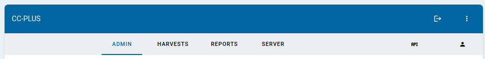

# Application Overview
The CC-PLUS application operates as a single-page application. Certain menu, filtering or options are dependent on the role(s) a user is assigned to when they login to the interface.

## Navigation

The main CC-PLUS navigation bar has options for :
### Admin (*Role: serverAdmin, consortiumAdmin, and institutional admins*)
  * Institutions
    * Institutions: Panel to manage member institutions
    * Institution Types: Panel for customizable institutions categorization(s) 
    * Institution Groups: (*Role: admin(s) of 1-or-more institutions*)  
      Panel to manage combining institutions for reporting, harvesting, or access
  * Users
    * Users: panel for managing users of the CC-PLUS application
    * Permissions: panel for setting and viewing user->role assignments
  * Platform Connections (*Role: serverAdmin, consortiumAdmin*)  
    panel for enabling which global platforms should be enabled and which master reports (PR/TR/DR/IR) can be harvested. *NOTE:: Definitions here will constrain harvesting options and choices.*
  * Credentials
    * Credentials: panel to view, add, import/export, test and manage institutional access to usage reports for global platform connections
    * Credential Audit: panel for reconciling stored/downloaded report data against CC-Plus configured settings (i.e. ensuring that the raw JSON data received for a given institution-platform credential correlates correctly)
### Harvests
  * Manual Harvest: panel to setup new harvest(s) of data from a provider
  * Harvest Queue: panel to view and managed active or pending harvests
  * Harvest Log: panelfor viewing and managing the log of harvesting.
### Reports
  * Report Scope  
    Panel controls the what to include in a given report, including the ability to save and recall previously configured reports and to load a preview (in the lower panel or to export the report records as CSV.)
  * Report Preview  
    Panel to view/preview the report summary for the defined Report Scope.
### Server (*Role: ServerAdmin*)
  * Consortia  
    Panel for managing consortia application-wide; consortium instances defined in the application reside in separate MySQL databases.
  * Platforms  
    This panel manages the platforms that supply usage data. It includes functions to retrieve known platform definitions from the COUNTER registry and uses this data as the "starting point" for how to connect to external providers and what those providers make available.
  * Settings  
    * Server Settings: panel for managing global, server-wide defaults for the application (including fiscal-year, max-retries for failed harvests, etc.)
    * Mail Settings: panel to manage server-wide email connectivity (for, at-minimum forgotten passwords)
### User profile
  * Account settings for the current user, including options to create user-specific personal access tokens for the API-based requests.
  * Saved Reports: panel for viewing and managing user-specific saved report configurations.
### API
  This page describes how to use personal access tokens (created and managed in the user profile) to access CC-Plus data and routes using API configuration in other/external applications. 
 

## Getting Started

1. [Initial Consortium Configuration](initial_tasks.markdown)
2. [Harvesting Reports](harvesting.markdown)
3. [Creating and Exporting Custom Reports](reports.markdown)
