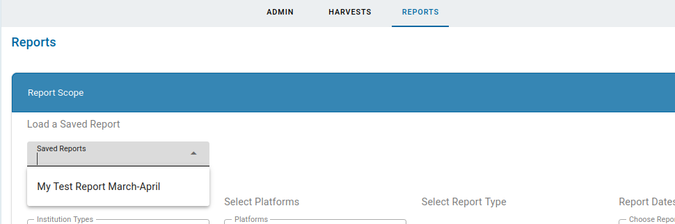
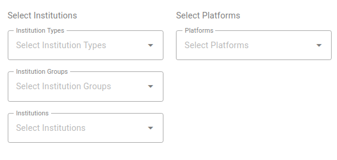
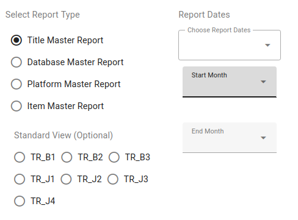
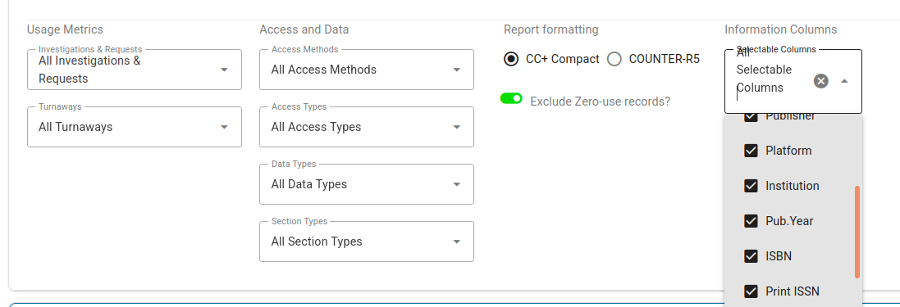
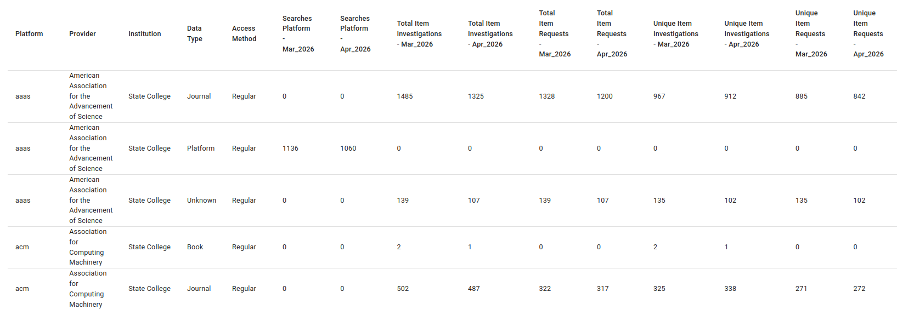
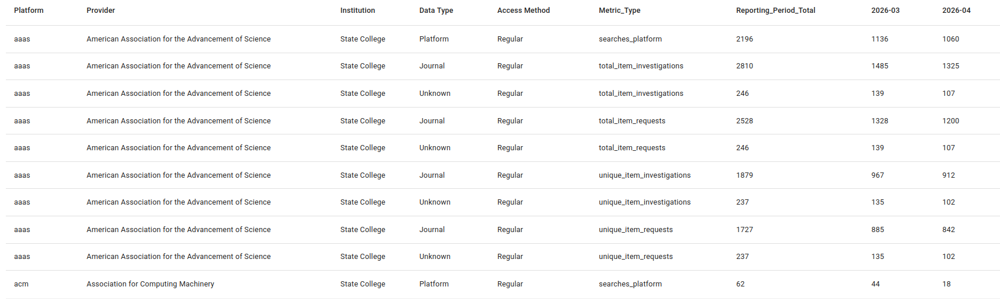
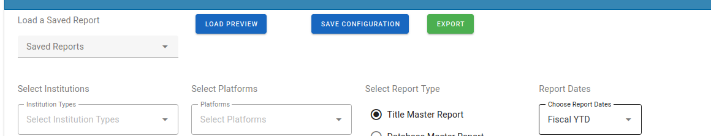

# Creating and Exporting Custom Reports

## Table of Contents
* [Creating a Report](#creating-a-report)
* [Saving a Report](#saving-a-report)
* [Exporting a Report](#exporting-a-report)

## Creating a Report

To create a report from harvested data using CC-PLUS, choose “Reports" from the main navigation. The screen opens with a panel to define the scope of the report. A complete set of options, some of which are optional and some that are required. If the user has previously saved report configuration(s), these are displayed in a dropdown above the options.

The drop-downs on this page for institutions and platforms are limiters, meaning that if you make no selection here all institutions you have access to and all platforms will be included in the report. Once you make a selection in any of these categories, the choices you have for reports will adapt to only allow you to create a report for which data is available.

Next choose a master report type and define the range of dates for the report
1. Clicking the Report Type radio buttons reveals the preset COUNTER “views” for each report type. These are for convenience; the CCPlus harvester collects all fields of the master-series and these can be turned on or off depending on what the user wants to see.
2. Report date ranges can be set to fiscal-year presets (YTD, LastFY), calendar year-to-date, or any custom range of month-year values.

Depending on the master report type, a set of optional metrics and fields provided for that report series will displayed. These are optional, but allow the user to hide/include specific data elements in the report.

The report formatting can be set to the CCPlus "Compact" format (one report row line platform/title/etc.) or using the standard COUNTER-R5 format.

Reports can be formatted in two different ways. The default, “CC+ Compact”, lists every title on a single row and breaks up the chosen metrics into separated columns.

You also have the option of formatting the report according to the COUNTER format which creates a new row for each metric type.

Once a master report and valid date range has been set in the panel, the runtime options will be enabled.

1. Load Preview: will generate a sample set of report records in the lower "Report Preview" panel.

2. Save Configuration: provides a popup dialog to allow saving of the current report configuration for later use, and optionally, replacing an existing saved configuration with the current one.

3. Export: initiates a download (full - as opposed to a preview) of the report records as a CSV to the browser.
